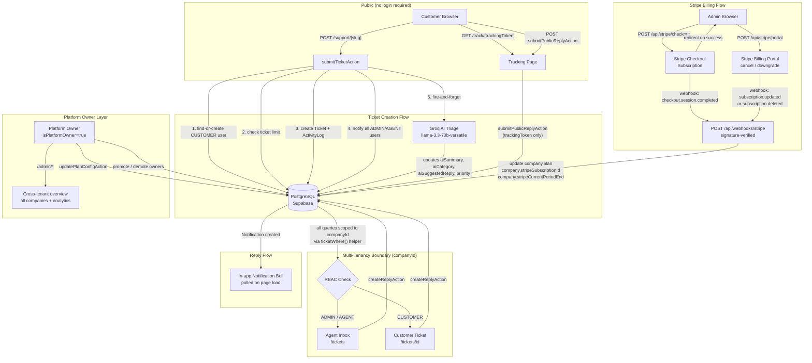
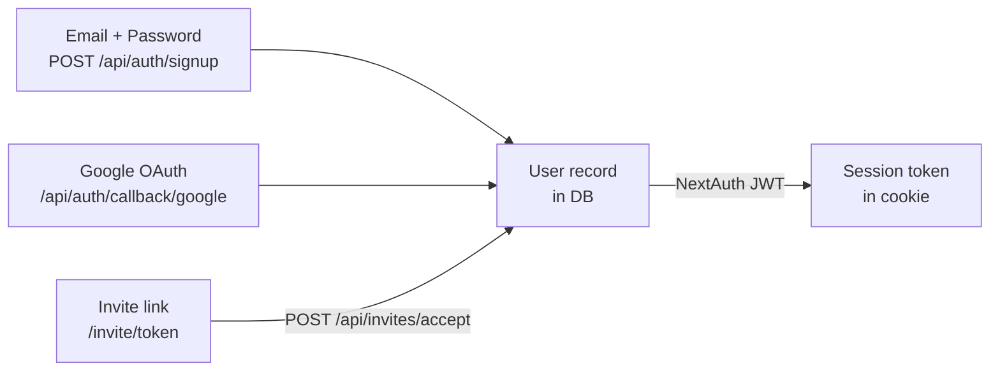
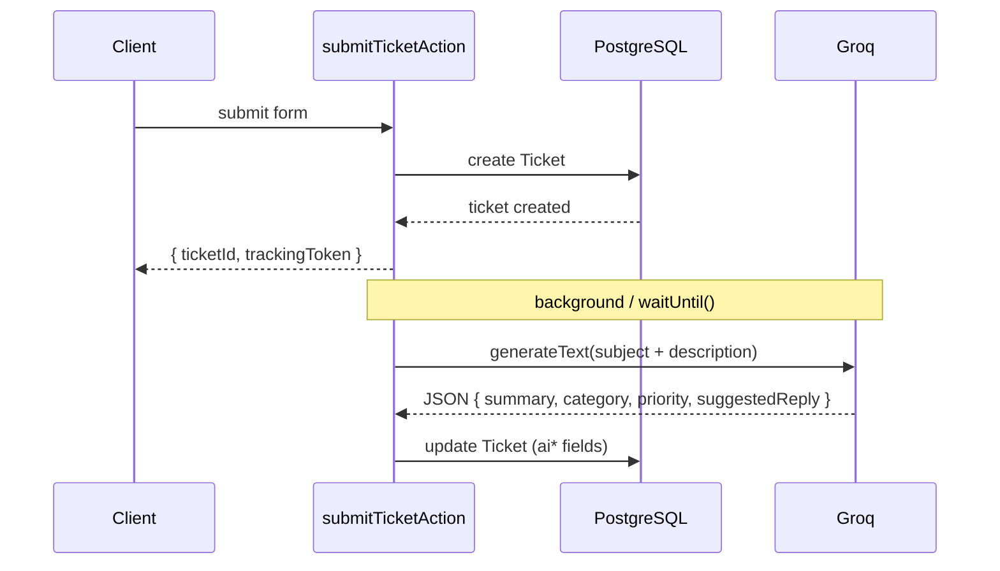

# SupportFlow — Architecture Overview

## System Architecture

---

## Multi-Tenancy

Every significant data model (`Ticket`, `Reply`, `Attachment`, `ActivityLog`, `InviteToken`, `Notification`) carries a `companyId` foreign key. The `ticketWhere()` helper in `lib/ticket-rbac.ts` builds the correct Prisma `where` clause based on the caller's role:

- **ADMIN / AGENT** — `{ companyId: session.user.companyId }` (all company tickets)
- **CUSTOMER** — `{ companyId: session.user.companyId, customerId: session.user.id }` (own tickets only)

This is applied on every ticket read in server actions and page data fetches. There is no cross-tenant data access except through the platform owner admin panel.

---

## Authentication Model

Two authentication paths feed into the same `User` model:

- Users belong to exactly one company.
- Role (`ADMIN`, `AGENT`, `CUSTOMER`) is stored on the `User` record, not the session provider.
- `isPlatformOwner` is a separate boolean, not a role — it grants access to `/admin/*` regardless of company.
- Middleware protects `/dashboard`, `/tickets`, `/admin`, `/analytics`, `/settings` — unauthenticated requests redirect to `/login`.

---

## AI Triage

Triage runs after every ticket creation (both agent-created and public submissions). It is **non-blocking** — the ticket is returned to the client immediately, and triage runs in the background.

If Groq times out (8s hard limit), is unreachable, or returns malformed JSON, the error is caught and logged — the ticket exists normally with `aiSummary`, `aiCategory`, and `aiSuggestedReply` left null.

---

## Notification System

Notifications are stored in the `notifications` table and linked to a `userId`. They are created server-side on:

- New public ticket submission → all ADMIN/AGENT users in the company
- Agent/admin reply → the ticket's customer
- Customer reply (authenticated or via tracking link) → the assigned agent, or all ADMIN/AGENT users if unassigned

**There is no real-time delivery.** The notification bell component fetches via `getNotificationsAction()` when the page loads and when the dropdown is opened. Unread count is derived from the fetched data client-side.

---

## Billing Enforcement

Plan limits are checked at the point of action, not at login:

- **Ticket limit** — checked in `checkTicketLimit()` (`lib/billing.ts`) before `createAgentTicketAction` and `submitTicketAction`. Counts tickets created since the start of the current calendar month.
- **Seat limit** — checked in `POST /api/invites` before generating an invite token. Counts active agents + admins + pending (unexpired, unused) invites.

Limits are enforced by hardcoded constants per plan tier in `lib/billing.ts`. The active plan is stored on the `Company` record and updated by Stripe webhooks.
